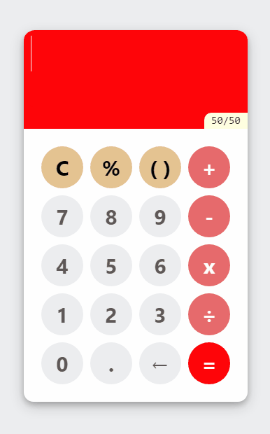

# React Demo Calculator App

This is a demo calculator app built entirely with the React JavaScript library.

## Screenshot:

  

## Features:

- Use the keypad or keyboard to enter a math expression in the display
- Click anywhere in the display with or without selection to add to the input
- Selection delete any part of the input with the back key
- Delete sequentially from any point in the input with the back key
- Use the keyboard backspace key to delete any part of the input

## Technology Stacks and Tools Used:

React version 17.0.2, mathjs library, jQuery library, gh-pages library, SOLID principles, SOC and DRY principles, HTML5, and CSS3, Visual Studio Code, Git, GitHub, and Azure DevOps

[Live Demo](https://rajndev.github.io/react-demo-calculator-app)
